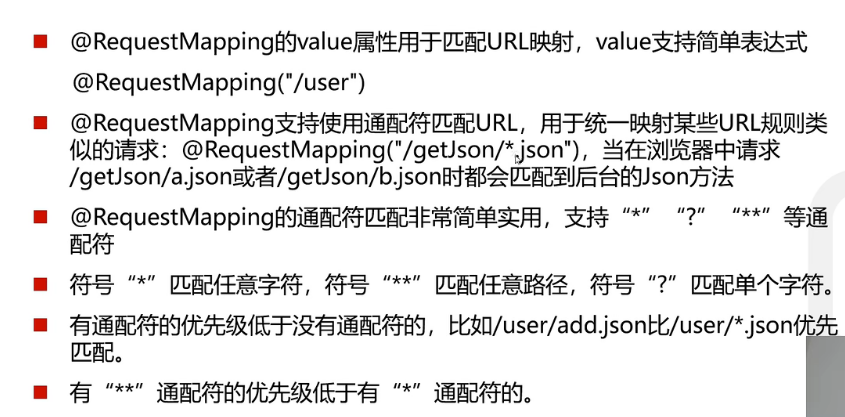

#后端原理
1. 控制器
   1. 注释
   
   2. 路由映射
   
   * value
   
   * 参数传递
   
      * GET方法：
      1. url与参数一致
      2. 使用 **(@RequestParam)**
            * value：定义要传递的参数
            * requires：默认true（必须传递该参数），可改成false
      * POST方法
      1. 接收json类型的数据，需要加上 **(@RequestBody)** 而且参数名和类型也要一致
      2. 可接收单独的参数，也可放在实体里
 2. 进阶
    1. 静态资源访问
       1. static :前后端分离不需要存放，可自定义
    2. 文件上传
      
      * 文件上传大小限制修改
      
      3. 拦截器
      
      
      
   